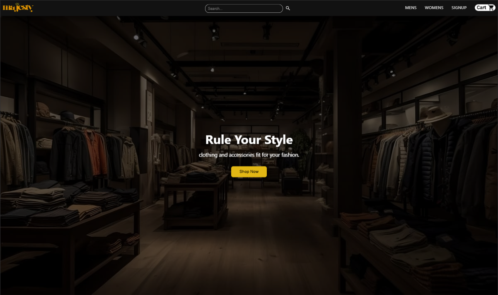
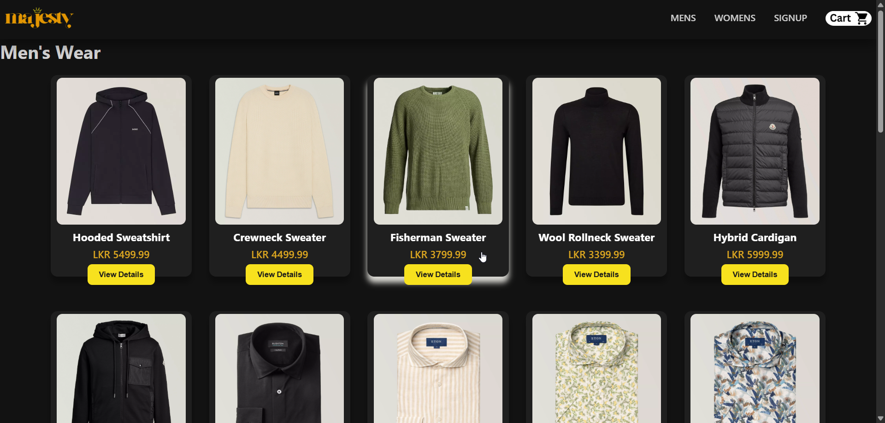
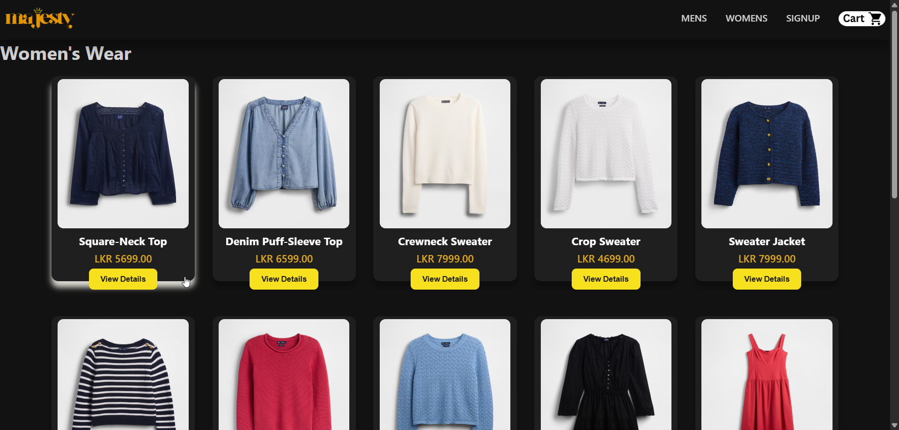
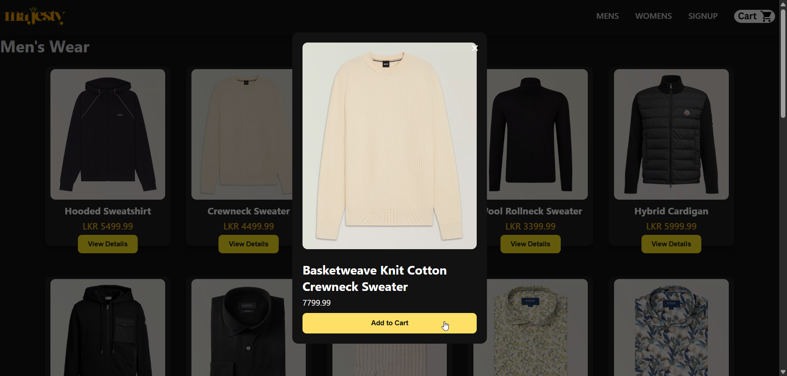
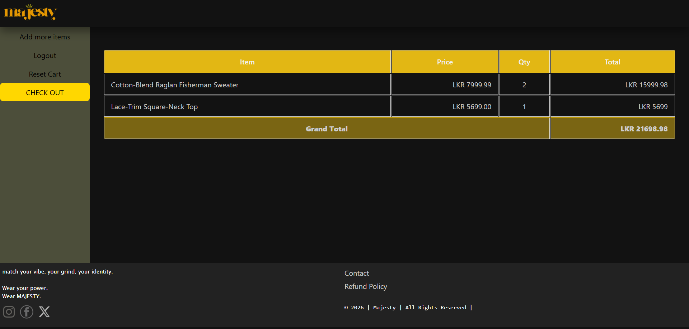
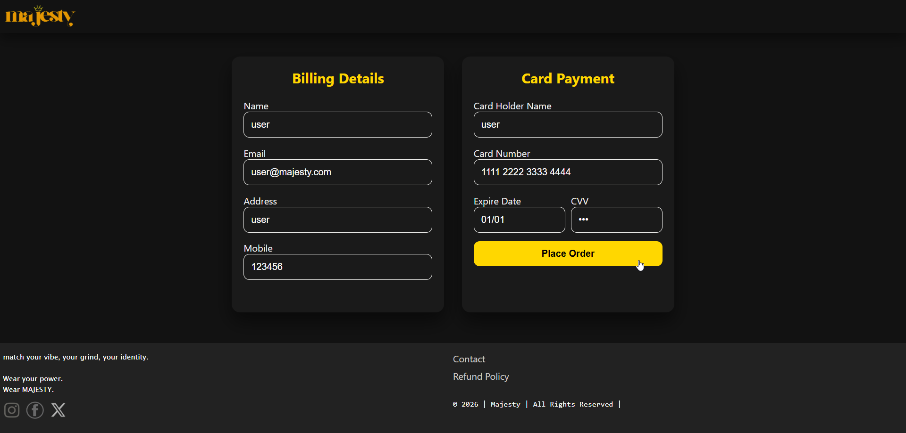
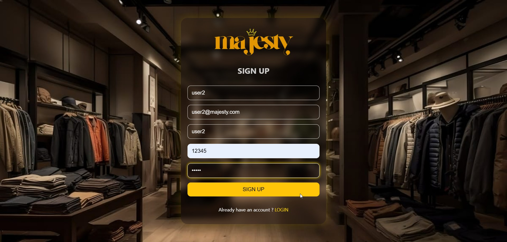

# Majesty

Majesty is an e-commerce clothing website built as part of the **Internet Services and Web Development (CSC113α)** course unit in the **1st semester** of the **Bachelor of Computer Science (BCS)** degree at the **University of Ruhuna, Sri Lanka**.  

This project demonstrates a full-stack web application with both frontend and backend components, designed to showcase web development and teamwork skills.

---

## Features

- Browse and view products
- Add items to cart
- Dummy checkout system
- Works on both **Docker** and **local XAMPP** setup

---

## Tech Stack

- **Frontend:** HTML, CSS, JavaScript  
- **Backend:** PHP  
- **Database:** MySQL (dummy data)  
- **Server:** XAMPP (local) or Docker containers  
- **Version Control:** Git & GitHub

---

## Installation / Setup

### **1. Run Locally with XAMPP**

1. Copy the project folder into XAMPP’s `htdocs` directory.  
2. Start **Apache** and **MySQL** from XAMPP.  
3. Import the dummy database (`testshopdb.sql`) via **phpMyAdmin**.  
4. Open in your browser:  http://localhost/Majesty_project/

### **2. Run with Docker**

1. Ensure Docker desktop is installed.  
2. Clone the repository:  
    ```bash
    git clone https://github.com/gaganajanith585-ship-it/Majesty_project.git
    cd Majesty_project
    ```

3. Build and run the Docker containers:

    `docker-compose up -d`

4. Access the project in your browser:

    http://localhost:8080

5. To stop containers:

    `docker-compose down`

**Note:** The project works the same way on both Docker and local XAMPP; Docker is recommended for easier setup.

---

## Usage

- Navigate products
- Add items to cart
- Users can **create a new account** or **log in with an existing account**
- Dummy account for testing

    **Username:** `user@majesty.com`    |   **Password:** `user`

---

## Screenshots 

### Homepage
<figure>
  
  <figcaption>Homepage</figcaption>
</figure>

### Product Page
<figure>
  
  <figcaption>Men's clothing section with products listed.</figcaption>
</figure>

<figure>
  
  <figcaption>Women's clothing section with products listed.</figcaption>
</figure>

<figure>
  
  <figcaption>Adding a product to the cart.</figcaption>
</figure>

### Cart / Checkout
<figure>
  
  <figcaption>Items in the cart with options to update quantity.</figcaption>
</figure>

<figure>
  
  <figcaption>Dummy checkout for purchases.</figcaption>
</figure>

### Login / Registration
<figure>
  
  <figcaption>Existing user login page.</figcaption>
</figure>

<figure>
  
  <figcaption>User registration page for creating new accounts.</figcaption>
</figure>

---

## Version

- **v1.0** – First release running on local XAMPP  
- **v1.1** – Introduced Docker support for easier setup 
- **v2.0** – File system restructured for better organization
